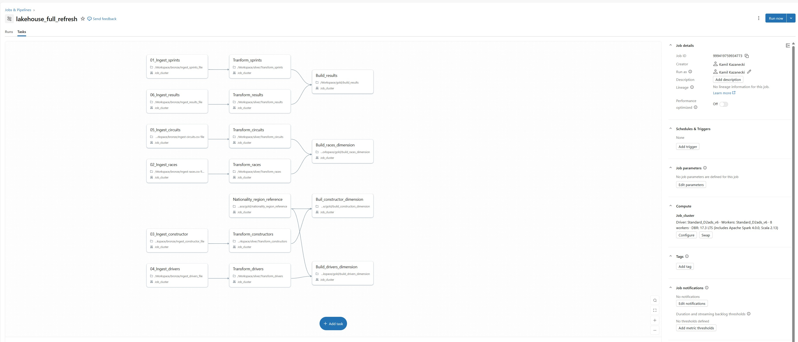
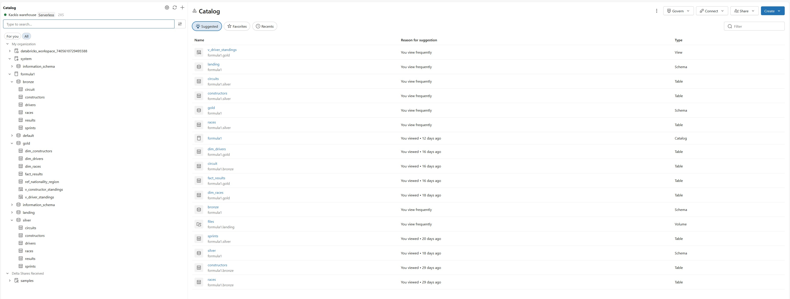

# Database_Formula1

### 1. Project Overview
Azure Databricks data engineering and analytics project using medallion architecture (bronze/silver/gold layers). Build using Apache Spark, Delta Lake, Azure Storage, workflows, analytical dashboards, pipeline for data processing and business reporting.e

### 2. Data Source
The dataset used in this project was provided as part of an educational course and is used here in accordance with the course portfolio usage permission -  "Azure Databricks & Spark Core For Data  Engineers" by Ramesh Retnasamy. 

All engineering, analytics, transformations, dashboards, and architecture implementations are my own work.

### 3. Solution Architecture

```
Source Data
   ↓
Azure Data Lake
   ↓
Databricks
   ↓
Bronze
   ↓
Silver
   ↓
Gold
   ↓
Dashboard
```

### 4. Data pipeline 


### 5. Lakehouse Data Organization


The project implements a Medallion Architecture using Unity Catalog in Azure Databricks.

- Landing layer stores source files.
- Bronze layer contains raw ingested data.
- Silver layer contains cleansed and transformed datasets.
- Gold layer contains dimensional models used for reporting and dashboarding
- Analytical layer contains SQL code, dashboards and diagrams

### 6. Dashboard Examples
 
   
### 7. Technology

Cloud Platform:
- Microsoft Azure

Data Processing:
- Azure Databricks
- Apache Spark
- PySpark
- SQL
- Python

Storage:
- Azure Data Lake Storage Gen2

Orchestration:
- Databricks Workflows

Analytics:
- Databricks Dashboards
