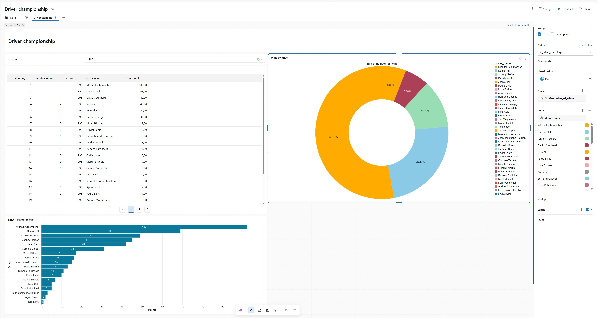

# Database_Formula1

### 1. Project Overview
Azure Databricks data engineering and analytics project using medallion architecture (bronze/silver/gold layers). Build using Apache Spark, Delta Lake, Azure Storage, workflows, analytical dashboards, pipeline for data processing and business reporting.e

### 2. Data Source
The dataset used in this project was provided as part of an educational course and is used here in accordance with the course portfolio usage permission -  "Azure Databricks & Spark Core For Data  Engineers" by Ramesh Retnasamy. 

All engineering, analytics, transformations, dashboards, and architecture implementations are my own work.

### 3. Business Objective

Data is distributed across multiple source files containing information about races, drivers, constructors, circuits, results, and sprint events. The objective of this project is to integrate these datasets into a single, consistent analytical model that enables analysis.

The data is cleansed, standardized, and enriched to create a reliable foundation for reporting. Race results are processed to assign championship points based on finishing positions, allowing the calculation of season standings for both drivers and constructors.

The final analytical layer enables users to:
* Analyze driver championship standings by season.
* Analyze constructor championship standings by season.
* Compare performance across different years and teams.
* Track historical Formula 1 trends and achievements.
* Generate dashboards and reports for business analysis.

For example, users can view the top-performing drivers in the 1953 season or analyze constructor rankings based on the cumulative points earned by their teams.

### 4. Solution Architecture

```
Source Data
   ↓
Azure Data Lake
   ↓
Databricks
   ↓
Bronze
   ↓
Silver
   ↓
Gold
   ↓
Dashboard
```

### 5. Data pipeline 


### 6. Lakehouse Data Organization


The project implements a Medallion Architecture using Unity Catalog in Azure Databricks.

- Landing layer stores source files.
- Bronze layer contains raw ingested data.
- Silver layer contains cleansed and transformed datasets.
- Gold layer contains dimensional models used for reporting and dashboarding
- Analytical layer contains SQL code, dashboards and diagrams

### 7. Dashboard Examples
 
best constructors in 1983

 
best drivers in 1995

More dashbords are in folder "docs"

### 8. Technology

Cloud Platform:
- Microsoft Azure

Data Processing:
- Azure Databricks
- Apache Spark
- PySpark
- SQL
- Python

Storage:
- Azure Data Lake Storage Gen2

Orchestration:
- Databricks Workflows

Analytics:
- Databricks Dashboards
